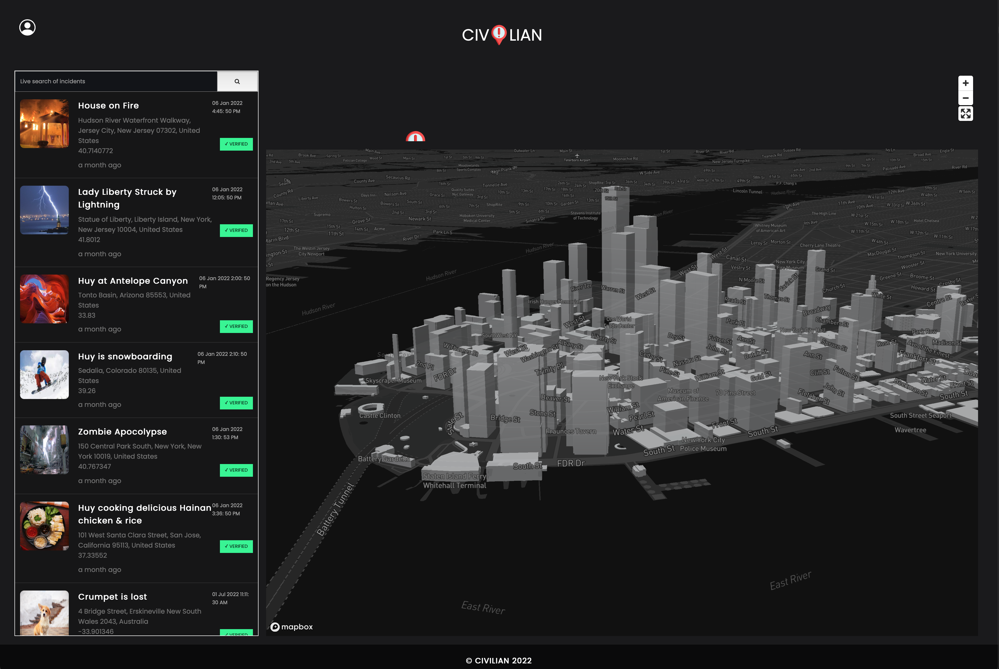

# Civilian

Basic web application based on Citizen, a mobile app used in New York, that lets users report incidents on a map and view the list of reported incidents on a map using Mapbox's Map services. This was built over 3 days to primarily interact with the Mapbox API and use the react-redux library. 



To interact or build on this app, you will need to insert your own database URI in database.js.

## Getting Started
1. Clone or fork this repo

```
git clone https://github.com/Heat-Seeking-Devil-Chicken-30/Civilian
```

2. Install the dependencies

```
npm install
```

3. Run script for development mode

```
npm run dev
```

4. Run tests

```
npm run test
```

## Built With
- React
- Redux
- Mapbox API
- Express
- Webpack 5
- Node
- Jest
- React Testing Library
- Supertest

## Contributors

[Rain Hsu](https://github.com/crumblepie) | [Johnson Che](https://github.com/JohnsonChe)  | [Mina Koo](https://github.com/alsdk850)  | [Huy Bui](https://github.com/huyqbui) 

## License

Licensed under MIT License.
